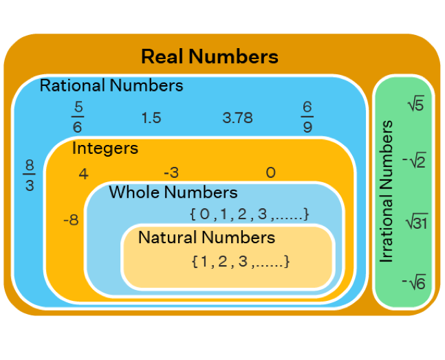
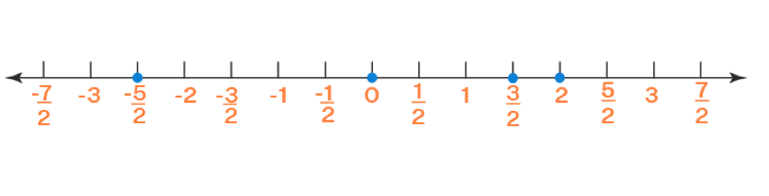
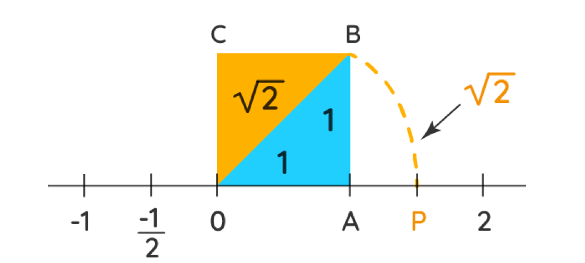

# دستگاه حقیقی

## مجموعه ها ی اعداد

بعضی مجموعه های اعداد در ریاضیات از اهمیت ویژه ای برخوردارند، به همین دلیل با نامگذاری خاصی این مجموعه ها را از مجموعه های دیگر متمایز می کنیم:

**مجموعه اعداد طبیعی**

$$
\mathbb{N} := \left\{ 1,2,3,\ldots \right\}
$$

**مجموعه ی اعداد شمارشی (حسابی)**

$$
\mathbb{W} := \left\{ 0,1,2,3,\ldots \right\}
$$

**مجموعه ی اعداد صحیح**

$$
\mathbb{Z} := \left\{ \ldots, - 2, - 1,0,1,2,\ldots \right\}
$$

**مجموعه ی اعداد گویا (کسری)**

$$
\mathbb{Q} := \left\{ \left. \ \frac{a}{b}\  \right|\ a,b\mathbb{\in Z}\ \&\ b \neq 0 \right\}
$$

**مجموعه ی اعداد گنگ (اصم)**

$$
\mathbb{Q}^{c} := \mathbb{R}\backslash\mathbb{Q}
$$

**مجموعه ی اعداد حقیقی**

$$
\mathbb{R} := \mathbb{Q}^{c} \cup \mathbb{Q}
$$

### تذکر:

+ مجموعه ی دیگری از اعداد نیز وجود دارد که به اعداد مختلط موسوم است و آن را با نماد $\mathbb{C}$ نمایش می دهند. با این مجموعه در درس های آینده آشنا خواهیم شد و خواهیم دید که $\mathbb{R \subset C}$.
+ از تعریف مجموعه های بالا واضح است که

$$
\mathbb{N \subset W \subset Z \subset Q \subset R}.
$$

$$
\mathbb{Q}^{c} \subset \mathbb{R}
$$

## مجموعه ی اعداد حقیقی

کلمه حقیقی که برای نامیدن اعداد حقیقی به کار می رود، در مقابل کلمه ی موهومی است که گاهی برای نامیدن اعداد مختلط به کار می رود. برای معرفی دستگاه اعداد حقیقی روش های مختلفی وجود دارد.ریاضیدان ایتالیایی جوزف پئانو پنج اصل موضوعه را برای اعداد طبیعی وضع نمود و این خود نقطه شروعی برای ساختن اعداد حقیقی بود.کارل وایر شتراس، ریچارد دد کیند و کانتور بزرگ هر کدام روشی برای ساختن اعداد گنگ از اعداد گویا مطرح کردند. در اینجا با نحوه ی ساختن با نحوه ی ساختن اعداد حقیقی کاری نداریم بلکه اعداد را به عنوان موجودات و اشیا تعریف نشده ی ریاضی در نظر می گیریم که از ویژگی هایی که اصول موضوعه نامیده می شوند پیروی می کنند. در اصول موضوعه زیر از حروف کوچک $a,b,c,\ldots,y,z$ برای نمایش اعداد حقیقی دلخواه استفاده می کنیم.

فرض کنید متناظر با هر دو عدد طبیعی $b$ و $a$ عدد حقیقی دیگری که آن را مجموع $bو\ a$ می نامند و با نماد $a + b$ نمایش می دهند موجود باشد، همچنین فرض کنید حاصل ضرب این دو عدد حقیقی باشد که با نماد $ab\ یا\ a.b$ نمایش داده می شود.مجموعه ی اعداد حقیقی به همراه اعمال جمع و ضرب در اصول موضوعه زیر صدق می کند:

**1. وجود عضو خنثا**

دو عدد یکتای 0 و 1 موجودند به طوری که به ازای هر عدد حقیقی $a$ داریم:

$$a.1 = a, \\ a + 0 = a$$

**2. وجود عضو وارون**

- به ازای هر عدد حقیقی $a$ عددی حقیقی مانند $b$  که آنرا قرینه (وارونه جمعی) عدد$a$ می نامند٬ وجود دارد به طوری که $$a + b = 0$$

- به ازای هر عدد حقیقی $a\neq 0$ عددی حقیقی مانند $b$  که آنرا معکوس (وارون ضربی) عدد$a$ می نامند٬ وجود دارد به طوری که $$a.b = 1$$

**3. قانون جابجایی**

به ازای هر دو عدد حقیقی $b$ و $a$ داریم 

$$ a + b = b + a \\
ab = ba$$

**4. قانون شرکت پذیری**

به ازای هر سه عدد حقیقی $a, b, c$ داریم

$$a + (b + c) = (a + b) + c \\ a(bc) = (ab)c$$

**5. قانون توزیع پذیری**

به ازای هر سه عدد حقیقی $a, b, c$ داریم

$$
a(b + c) = ab + ac.
$$

### گزاره

با به کار بردن اصول بالا به راحتی می توان خواص زیر را نتیجه گرفت

1. قرینه (وارون جمعی) $a$ یکتاست و آنرا با $-a$ نمایش می دهیم.

2. معکوس (وارون ضربی) $a$ یکتاست و آنرا با $a^{-1}$ یا $\frac{1}{a}$ نمایش می دهیم.

3. **قانون حذف برای جمع**: هر گاه $a + b = b + c$ آن گاه $a = b$

4. **قانون حذف برای ضرب**: هر گاه $c \neq 0$ و $ac = bc$ آنگاه $a = b$

5. هر گاه $ab = 0$ آن گاه $b = 0$ یا $a = 0$

6. هر گاه $d \neq 0$ و $b = 0$ آن گاه $.\frac{a}{b}.\frac{c}{d} = \frac{ac}{bd}$

7. هر گاه $d \neq 0$ و $ b = 0$ آن گاه $.\frac{a}{b} + \frac{c}{d} = \frac{ad = bc}{bd}$

8. **طرفین-وسطین**: هر گاه $ad = bc\ \frac{a}{b} = \frac{c}{d}$ و $ d \neq 0 ،b \neq 0$

9. **دور در دور و نزدیک در نزدیک**: هرگاه $d \neq 0$ و $ c \neq 0 ،b \neq 0$ آن گاه $.\frac{\frac{a}{b}}{\frac{c}{d}} = \frac{ad}{bc}$

10. هر گاه $a^{2} + b^{2} = 0$ آن گاه $a = 0$ و $b = 0$

### مثال

- اگر $x\left( x^{2} - 1 \right) = 0$ آنگاه $x^{2} - 1 = 0$ یا $x = 0$

- در تساوی $\frac{x}{x^{3} + x + 1}.\frac{x^{2} - 1}{5} = \frac{x(x^{2} - 1)}{5(x^{3} + x + 1)}$ حاصل ضرب دو کسر تبدیل یک کسر شده است، اما در بسیاری از موارد باید عکس این کار را انجام دهیم، یعنی کسر $\frac{x(x^{2} - 1)}{5(x^{3} + x + 1)}$ را به صورت $\frac{x}{x3 + x + 1}.\frac{x^{2} - 1}{5}$ بنویسیم.

- $\frac{3 + 5}{3} \neq 5$ ، یعنی حق نداریم *3* در صورت کسر را با *3* درمخرج کسر ساده کنیم.

- ولی در عبارت $\frac{3 \times 5}{3}$ می توان *3* در صورت کسر را با *3* در مخرج کسر ساده نمود و نوشت $\frac{3 \times 5}{3}$*=5*

- $\frac{\frac{x}{x^{2} - 1}}{\frac{5}{x^{2} + 1}} = \frac{x(x^{2} + 1)}{5(x^{2} - 1)}$

## اعداد اعشاری

اعداد اعشاری به دو دسته تقسیم می شوند:

الف. اعداد اعشاری مختوم (اعداد با تعداد ارقام اعشاری متناهی)، مانند $.\frac{3}{14,}\frac{12}{21},\frac{5}{4}$

ب. اعداد با تمام ارقام اعشاری نامتناهی که خود به دو دسته تقسیم می شود

1. اعدادی که در آنها یک دسته از ارقام اعشار تکرار می شود، این دسته از اعداد گویا است.

برای مثال

$$
\frac{1}{3} = 0.333\ldots = 0.\overline{3} \in Q.
$$

2. هیچ دسته از ارقام اعشار به طور متناوب تکرار نمی شود، مانند اعضای $Q^{c}$ برای مثال،

$$
\pi = 3.1415926535\ldots \in Q^{c}.
$$

همچنین

$$
e = 2.7182818284\ldots  \in Q^{c}.
$$

### مثال

نشان دهید که $0.9999\ldots = 1$

اثبات.

$$
\begin{align*}
0.9999 \ldots &= 0.9 + 0.09 + 0.009 + 0.0009 + \ldots \\
&= \frac{9}{10} + \frac{9}{100} + \frac{9}{1000} + \frac{9}{10000} + \ldots \\
&= \frac{9}{10} + \frac{9}{100} + \frac{9}{1000} + \frac{9}{10^{5}} + \ldots \\
&= \frac{9}{10}\left( 1 + \frac{1}{10} + \frac{1}{100} + \frac{1}{1000} + \ldots \right)
\end{align*}
$$

که عبارت داخل پرانتز یک تصاعد هندسی با قدر نسبت $q = \frac{1}{10}$ و $t_{1 =}1$ است پس

$$
0.9999 \ldots = \frac{9}{10}\left( \frac{1}{1 - \frac{1}{10}} \right) = \frac{9}{10}\left( \frac{10}{9} \right) = 1.
$$

تذکر:

از دبیرستان با تصاعد هندسی آشنایی داریم، در یک تصاعد هندسی که جمله اول آن $t_{1}$ و قدر نسبت آن $q$ باشد داریم:

$$
|q| > 1 \Rightarrow s_{n} = \frac{t_{1}\left( 1 - q^{n} \right)}{1 - q}
$$

$$
|q| < 1\overset{n \rightarrow \infty}{\Rightarrow}s_{n} = \frac{t_{1}}{1 - q}
 $$.

### بی نهایت
از نماد $\infty$ که بی نهایت خوانده می شود بسیار استفاده خواهیم کرد توجه کنید که بی نهایت یک عدد نیست بلکه صرفا نمادی را برای نشان دادن یک مفهوم ریاضی است، این مفهوم که یک عدد حقیقی می تواند از هر اندازه ی قابل تصور باز هم بیشتر و بزرگتر باشد را با نماد $\infty$ نشان می دهیم. از آن جایی که $\infty$ نمادی برای بیان یک مفهوم ریاضی است پس هرگز نمی توان آن را در محاسبات مانند اعداد به کاربرد و نوشت $\infty - \infty = 0$ یا $.\frac{\infty}{\infty}$

برای مثال اگر از بی نهایت عدد طبیعی بی نهایت عدد فرد کنار گذاشته شود، همچنان بی نهایت عدد زوج باقی خواهد ماند.

## ترتیب اعداد حقیقی
خاصیت ترتیب اعداد حقیقی که یک سرمایه ی بزرگ و ذاتی آنها است ریشه ی بسیاری از مفاهیم کاربردی این اعداد به شمار می رود. اگر بخواهیم مفهوم ترتیب را به مجموعه ی اعداد حقیقی القاء نماییم، لازم است مفاهیم مثبت و منفی بودن اعداد را مطرح نماییم. برای این که با بعضی مفاهیم محض و بنیادین درگیر نشویم، مفهوم مثبت بودن را به عنوان یک مفهوم تعریف نشده ی ریاضی می پذیریم.

مجموعه ی اعداد حقیقی مثبت را با نماد $\mathbb{R}^{+}$ و مجموعه ی همه ی اعداد حقیقی منفی را با نماد $\mathbb{R}^{-}$ نشان می دهیم. $\mathbb{R}^{+}$ با سه اصل موضوعه زیر مشخص می شود:

الف. $.0 \neq \mathbb{R}^{+}$

ب .به ازای هر عدد حقیقی ناصفر $a$ یا $a \in \mathbb{R}^{+}$ یا $- a \in \mathbb{R}^{+}$.
(مقصود از حرف ربط یا، همان یا در زبان فارسی است. که با حرف ربط یا در زبان ریاضی( در منطق دوارزشی) کمی متفاوت است.)

ج. حاصل جمع و ضرب هر دو عدد حقیقی مثبت مجددا یک عدد حقیقی مثبت خواهد بود، به اصطلاح ریاضی مجموعه ی $\mathbb{R}^{+}$ نسبت به اعمال جمع و ضرب بسته است.

از این سه اصل موضوعه، مفاهیم کوچکتری و بزرگتری متولد می شوند:

### تعریف 

- می گوییم $a$ کوچکتر از $b$ است و می نویسیم $a < b$، هر گاه $b - a$ مثبت باشد.
- می گوییم $\ a$ بزرگتر از $b$ است و مینویسیم $a > b$، هر گاه $a - b$ مثبت باشد.
- می گوییم $a$ کوچکتر یا مساوی با $b$ است و می نویسیم $،a \leq b$ هر گاه $a < b$ یا $a = b$ باشد.
- می گوییم $a$ بزرگتر یا مساوی با $b$ است و می نویسیم $،a \geq b$ هر گاه $a > b$ یا $a = b$ باشد.

پس اگر $a > 0$ آن گاه $a$ مثبت است، و اگر $0 > a$ آن گاه $a$ مثبت نیست. اگر$a$ عددی مثبت نباشد آن را منفی می نامیم.

حال با استفاده از اصول موضوعه ی بالا و مفاهیم کوچکتری و بزرگتری می توان قضایای مهمی را نتیجه گرفت، که یکی از مهم ترین آنها قانون تثلیت است:

### قانون تثلیت

به ازای هر دو عدد حقیقی $a$ و $b$ یکی و تنها یکی از سه رابطه ی زیر درست است:

الف. $a \gt b$

ب. $a \lt b$

ج. $a = b$

### گزاره

الف. هر گاه $b \lt c$ و $a \lt b$ آن گاه می توان نتیجه گرفت $a \lt c$ این مطلب به قانون قیاس معروف است.

ب. به طرفین یک نامساوی میتوان یک عدد ثابت مانند $c$ را اضافه نمود، همچنین از طرفین یک نامساوی می توان یک عدد ثابت مانند $c$ را کم کرد.

ج. اگر طرفین یک نامساوی را در عددی مثبت مانند $c > 0$ ضرب کنیم، جهت نامساوی عوض نمی شود به عبارت دیگر هرگاه $ac \gt bc$  آنگاه  $c \gt 0$ و $a \gt b$

د. اگر طرفین یک نامساوی را در عددی منفی مانند $c \lt 0$ ضرب کنیم، جهت نامساوی عوض می شود به عبارت دیگر هرگاه $ac \lt bc$ آنگاه  $c \lt 0$ و $a \gt b$

ه. اگر طرفین یک نامساوی را بر عددی مثبت مانند $c \gt 0$ تقسیم نماییم جهت نامساوی عوض نمی شود به عبارت دیگر هرگاه $\frac{a}{c} \gt \frac{b}{c}$ آنگاه $c \gt 0$ و $a \gt b$

و. اگر طرفین یک نامساوی را بر عددی منفی مانند $c \lt 0$ تقسیم نماییم، جهت نامساوی عوض می شود به عبارت دیگر هرگاه $.\frac{a}{c} \lt \frac{b}{c}$ آنگاه $c \lt 0$ و $a \gt b$

ز. اگر طرفین یک نامساوی هم علامت باشند و جای صورت و مخرج را با هم عوض کنیم یعنی طرفین را معکوس نماییم، جهت نامساوی عوض می شود

به عبارت دیگر هر گاه $\frac{a}{b} \lt \frac{c}{d}$ و این دو کسر هم علامت باشند، یعنی $\frac{a}{b} \gt 0$ و $\frac{c}{d}\gt 0$ یا این که $\frac{a}{b} \lt 0$ و $\frac{c}{d} \lt 0$ آن گاه $\frac{b}{a} \gt \frac{d}{c}$.

### اصل ارشمیدسی اعداد حقیقی

به ازای هر عدد حقیقی $x$ عددی طبیعی مانند $n_{x}\mathbb{\in N}$ وجود دارد به طوری که $.n_{x} > x$

تذکر: البته گاهی یک گزاره ی دیگر (خاصیت زیرینه) را به عنوان یک اصل در نظر می گیرند و این گزاره را به عنوان یک لم اثبات می کنند.

### نتیجه

به ازای هر عدد حقیقی مثبت $x$ عددی طبیعی مانند $n_{x}\mathbb{\in N}$ وجود دارد به طوری که $.\frac{1}{n_{x}} < x$

برهان. اصل ارشمیدسی و قضایای نا مساوی ها را به کار ببرید.

## نمایش اعداد حقیقی

برای نمایش اعداد حقیقی از یک محور افقی که دارای دو جهت است استفاده می کنیم. ابتدا نقطه ی دلخواه و ثابت واقع بر آن به عنوان مبدأ محور و مکان این نقطه را متناظر با نمایش عدد صفر در نظر می گیریم، اعدادی که در سمت راست مبدأ واقعند، مثبت و اعدادی که در سمت چپ مبدأ واقعند منفی هستند.

تذکر: برای نمایش اعداد حقیقی لازم نیست حتمأ از یک محور افقی استفاده شود.بلکه می توان از یک محور عمودی نیز استفاده نمود.

### مثال 

مکان $+ \sqrt{2}$ را روی محور اعداد حقیقی مشخص نمایید.

حل. 

باید نقطه ای که در سمت راست مبدأ و فاصله ی آن تا مبدأ به اندازه ی $\sqrt{2}$ است را بیابیم. بنابر قضیه ی معروف فیثاغورث برای یک مثلث قائم الزاویه با اضلاع به اندازه ی 1 به اندازه ی وتر برابر است با: $.\sqrt{1^{2} + 1^{2}} = \sqrt{2}$

مثلث قائم الزاویه ی زیر را مطابق شکل بر محور اعداد قرار می دهیم.

اگر با پرگار دایره ای به مرکز مبدأ و شعاع $OB$ را مطابق با شکل زیر رسم کنیم، این دایره محور اعداد حقیقی را در نقطه ای مانند $P$ قطع می کند. چون $OB$ شعاع دایره است بنابراین $OP = \sqrt{2}$، پس نقطه ی $P$ مکان $\sqrt{2}$ است.

## بازه ها

به ازای دو عدد حقیقی $a,b \in \mathbb{R}$ مجموعه ی همه ی اعداد حقیقی بین $b$ و $a$ را یک بازه یا فاصله می گویند. بر حسب این که نقاط ابتدایی یا انتهایی $b$ و $a$ متعلق به این بازه باشند یا متعلق به بازه نباشند حالت های مختلفی مطرح می شود. برای هر $a,b \in \mathbb{R}$ بازه ها بصورت زیر تعریف می شوند:

::: {dir="ltr"}
- $\lbrack a,b\rbrack = \left\{ x \in \mathbb{R} \middle| a \leq x \leq b \right\}$

- $\left. \left \lbrack a,b \right. \right) = \left\{ x \in \mathbb{R} \middle| a \leq x < b \right\}$

- $\left( a,\left. \ b \right\rbrack \right.\  = \left\{ x \in \mathbb{R} \middle| a \lt x \leq b \right\}$

- $(a,b) = \left\{ x \in \mathbb{R} \middle| a \lt x \lt b \right\}$

- $(a, + \infty) = \left\{ x \in \mathbb{R} \middle| a < x < + \infty \right\} = \left\{ x \in \mathbb{R} \middle| x > a \right\}$

- $\left\lbrack a,\left. \  + \infty \right) \right.\  = \left\{ x \in \mathbb{R} \middle| a \leq x < + \infty \right\} = \left\{ x \in \mathbb{R} \middle| x \geq a \right\}$

- $( - \infty,b) = \left\{ x \in \mathbb{R} \middle| - \infty \lt x \lt b \right\} = \left\{ x \in \mathbb{R} \middle| x \lt b \right\}$

- $\left( - \infty,\left. \ b \right\rbrack \right.\  = \left\{ x \in \mathbb{R} \middle| - \infty < x \leq b \right\} = \left\{ x \in \mathbb{R} \middle| x \leq b \right\}$

- $( + \infty, + \infty) = \left\{ x \in \mathbb{R} \middle| - \infty \lt x \lt + \infty \right\} = \left\{ x \in \mathbb{R} \middle|  \in \mathbb{R} \right\} = \mathbb{R}$

- $\mathbb{R}^{*} = \lbrack - \infty, + \infty\rbrack$
:::

### تذکر

- با توجه به تعریف بالا برای بازه می توان گفت مجموعه ی تهی و مجموعه ای تک عضوی نیز بازه به حساب می آیند.

- $\mathbb{R}^{*}$ مجموعه ی اعداد حقیقی گسترش یافته است و تنها در سطوح پیشرفته ی ریاضی ممکن است با آن مواجه شوید.

### مثال
عدد حقیقی نا منفی $a$ مفروض است، اگر به ازای هر عدد حقیقی مثبت $\epsilon$ داشته باشیم $a \lt \epsilon$ ، آن گاه $a = 0$.

حل.

اگر $a > 0$ آن گاه بنا بر نتیجه ی اصل ارشمیدسی عددی طبیعی مانند $n_{a} \in\mathbb{ N}$ وجود دارد به طوری که $.\frac{1}{n_{a}} <div a$ قرار می دهیم $\epsilon = \frac{1}{n_{a}}$، اما این متناقص با فرض مساله است که می گوید به ازای هر عدد حقیقی مثبت $\epsilon$ داشته باشیم $a \lt 0$. پس فرض $a \gt 0$ باطل است و بنابراین $a = 0$.
