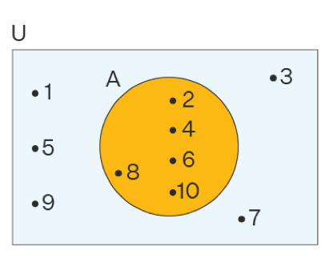

# مجموعه

## تعریف مجموعه

مجموعه از جمله اصطلاحات تعریف نشده ی دنیای ریاضی (مانند نقطه و خط در
هندسه) است که آن را به این صورت توصیف می کنند:

به هر دسته از اشیای معین و دو به دو متمایز مجموعه می گویند و هر یک از
این اشیا عضو مجموعه نامیده می شود.

این توصیف اولین بار توسط جورج کانتور که در سال 1895 نظریه مجموعه ها را
پایه گذاری نمود بیان شده است. باید توجه کرد که هر شی به طور قاطع ،در آن
مجموعه هست یا نیست. مجموعه ها را معمولا با حروف بزرگ لاتین
مانند $C,B,A$ ، X و غیره اعضای آن را با حروف
کوچک لاتین مانند $a,b,c$ و غیره نشان می دهند.

### مثال

هر یک از مثالهای زیر یک مجموعه را تشکیل می دهند.

* نام روز های هفته

* نام فصل های سال

* حافظ، سعدی و مولوی

* سه حروف ابتدای حروف لاتین

هر یک از مثالهای زیر یک مجموعه را تشکیل نمی دهند.

* اعداد بزرگ

* افراد خوب

* شعری معروف

* انسان های خوشبخت روی زمین

## عضویت

* عضویت $a$ را در مجموعه $A$ بصورت $a \in A$ می نویسیم و می خوانیم $a$ عضو $A$ است یا $a$ تعلق دارد به مجموعه $A$ و یا $a$ متعلق $A$ است و یا $A$ شامل $a$ است. 

* اگر $a$ در مجموعه $A$ نباشد آن را به صورت $a \notin A$ می نویسیم ومی خوانیم $a$ عضو $A$ نیست و یا $a$ تعلق ندارد به $A$ و یا $A$ شامل $a$ نیست.

* عضویت یا تعلق را با علامت ($\in$) و عدم عضویت را با نماد ($\notin$) نشان می دهند.

### مثال

مجموعه $A = \{ 2,3,5,6,7\}$ را در نظر بگیرید کدام یک از
مفاهیم مفاهیم زیر صحیح است ؟

$$
1) 1 \notin A ; \ \
2) 2 \in A ; \ \
3) 5 \notin A ; \ \
4) 7 \in A ; \ \
5) 9 \in A
$$

**حل :**

قسمت های 1,2,4درست وقسمت های 3,5 نادرست
هستند.

## نمایش تفضیلی

نمایش تفضیلی یعنی نمایش مجموعه با نوشتن عضو ها. تک تک عضو های مجموعه
را در داخل دو آکولاد قرار می دهیم و هر دو عضو را با کاما از هم جدا می
کنیم.

### مثال

نمایش تفضیلی مجموعه حروف صدادار الفبای لاتین را به صورت زیر
نوشت:

$$A = \{ a,e,i,o,u\}$$

دقت کنید که بنابر آن چه تکراری نوشتن اعضای یک مجموعه گفته
شد.نماد $\{ a,a,,u,e,i,o,u\}$ معرف مجموعه ی جدیدی نیست بلکه
نسخه دیگری از مجموعه ی $A$ است

اگر $B$ مجموعه نام فصل های سال باشد٬ نمایش تفضیلی آن بصورت
زیر است:

{ بهار، تابستان ، پاییز ، زمستان}

## مجموعه مرجع

در هر مبحث ریاضی مجموعه ای را در نظر می گیریم که تمام اشیاء مورد بحث
عضو آن می باشند با تمام مجموعه های مورد بحث زیر مجموعه آن مجموعه می
باشند آن مجموعه را مجموعه مرجع یا مجموعه کل یا عالم سخن
نامند.

### مثال 

در هندسه مجموعه نقاط صفحه مجموعه مرجع است.

در جبر مقدماتی مجموعه $\mathbb{R}$ مجموعه مرجع است.

## متمم یک مجموعه

متمم یک مجموعه $A$ را با نماد $A^{'}$
یا $A^{c}$ یا $A$ نشان می دهند و مجموعه
تمام اشیایی است که عضو مجموعه مرجع هستند ولی عضو A
نیستند.بنابراین

$$A = \{ x:x \in M,x \notin A\}$$

### مثال

اگر $M = \{ 1,2,3,4,\ldots,10\}$ و
$A = \{ 1,3,5,7,9\}$ آنگاه

$$A^{c} = \{ 2,4,6\}$$

## نمایش توصیفی

هر خاصیت مجموعه ای را مشخص می کند که هر یک از اعضای آن مجموعه واجد آن
خاصیت است و هر چیزی که دارای این خاصیت باشد به آن مجموعه تعلق دارد.
اگر خاصیت مفروض را p بنامیم تمام اشیائ هایی که دارای
خاصیت p هستند یک مجموعه مانند $A$ را مشخص می
کنند. و این مجموعه را به این صورت زیرمی توان نوشت و میخوانیم
مجموعه x هایی که ، x خاصیت p
دارد

$$A = \{ x|p(x)\}$$

### مثال

مجموعه اعداد طبیعی کوچکتر از 24 را به زبان ریاضی بنویسید.

$$\{ n\left| n \in N,n \lt 24 \right\}$$

مجموعه اعداد صحیح بین $- 2$ و $3$
($- 2$ و $3$ ) را یک بار نوشتن عضو ها و بار
دیگربا علائم ریاضی بنویسید.

$$A = \left\{ - 1,0,1,2 \right\} $$
$$ A = \{ x|x \in Z, - 2 \lt x \lt 3\}$$

مجموعه اعداد صحیح زوج را یک بار با نوشتن عضو ها و بار دیگر با علائم
ریاضی بنویسید.

$$B = \{\ldots\ldots,6, - 4, - 2,0,2,4,6,\ldots.\}$$

$$B = \{ 2x|x \in Z\}$$

مجموعه $A = \{ x|x \in N,x^{2} - 1 = 0\}$ را با نوشتن
عضو ها مشخص کنید.

$$x^{2} - 1 = 0 \Rightarrow \ x^{2} = 1 \Rightarrow x \pm 1$$

چون $x \in N$ فقط $x = 1$ قابل قبول است.
پس:$A = \{ 1\}$

مجموعه $\{ x|x \in R,x^{2} - 3x + 2 = 0\}$ را با نوشتن
عضو ها مشخص کنید.

جواب:$\{ 1,2\}$

## نمایش ون

گاهی برای بررسی درستی یا نادرستی گزاره ها در نظر یه ی مجموعه ها از
تصویری به نام نمایش ون استفاده می کنند. معمولا در این تصاویر از یک
مستطیل برای نشان دادن مجموعه ی مرجع و برای نمایش هر یک از زیر مجموعه های
ان از دایره هایی که داخل این مستطیل رسم می شوند. استفاده می
کنند.

### مثال

اگر مجموعه مرجع اعداد طبیعی ۱ تا ۱۰ باشد و 
مجموعه $A$ اعداد زوج باشند نمایش ون مجموعه $A$ بصورت زیر است:

## تساوی مجموعه ها

دو مجموعه $A$ و $B$ با هم مساوی اند هرگاه
هر عضو $A$ عضو $B$ و هر عضو $B$
عضو $A$ باشد.

دو مجموعه $A$ و $B$ با هم مساوی نباشند آنگاه
حد اقل یکی از دو مجموعه $A$و$B$ عضوی داشته
باشد که در دیگری نباشد در این حالت می نویسیم
$A \neq B$.

### مثال

مجموعه های
$\left\{ 1,2,2,3,3,3,3 \right\},\left\{ 1,3,2 \right\},\{ 1,2,3\}$ با
هم مساوی اند. چنانچه دیده می شود، تکرار و جابجایی عضو ها، مجموعه را
عوض نمی کند.

$$\left\{ 1,2 \right\} \neq \{ 1,3\}$$

## تهی و یکانی

مجموعه ایی که عضو ندارد را مجموعه تهی یا خالی گوییم و آن را با
علامت $\{\ \}$ یا $\varnothing$ نمایش می دهیم.

مجموعه را که فقط یک عضو دارد را مجموعه یکانی یا منفرد
نامند.

### مثال

* مجموعه اعداد طبیعی بین $2$ و $1$ یک مجموعه تهی
است.

* مجموعه اعداد طبیعی اول زوج یک مجموعه یکانی است $\{ 2\}$

* $\left\{ \varnothing \right\} و\ \{ 0\}$ تهی نیستند
زیرا هر کدام یک عضو دارند.

## مجموعه های اعداد

1-مجموعه اعداد طبیعی :

$$\mathbb{N} = \{ 1,2,3,\ldots\}$$

2-مجموعه اعداد حسابی:

$$\mathbb{W} = \{ 0,1,2,3,\ldots\}$$

3-مجموعه اعداد صحیح :

$$\mathbb{Z} = \{\ldots, - 3, - 2, - 1,0,1,2,3,\ldots\}$$

4-$\ $مجموعه اعداد گویا :

$$\mathbb{Q} = \{\frac{a}{b}|a,b \in Z,b \neq 0\}$$

هرعددی که گویا نباشد را گنگ نامند
$\ldots,e,\pi,\frac{- 1}{\sqrt{5}},\sqrt{2}$

5-مجموعه اعداد حقیقی را با $\mathbb{R}$ نمایش می دهند و عضو هایش
عبارتند از تمام اعداد گنگ (اصم )و گویا.

6-مجموعه اعداد مختلط :

$$\mathbb{C} = \{ a + ib: a,b \in R,i^{2} = - 1\}$$

## زیر مجموعه

مجموعه $A$ زیر مجموعه $B$ گویند هر گاه هر عضو
مجموعه $A$ یک عضو مجموعه $B$ باشد.این مفهوم را
با نماد $A \subseteq B$ نمایش می دهند نماد ((
$\subseteq$ )) به معنای زیر مجموعه یا جزئیت است.

$$A \subseteq B \Leftrightarrow (\forall x,x \in A \Rightarrow x \in B)$$

اگر هر عضو $A$ ،عضو B باشد ودر B
عضوی باشد که در $A$ نباشد در این صورت $A$ را زیر
مجموعه محض یا سره B نامند و به صورت
$A \subset B\ $ می نویسند.

اگر عضوی در مجموعه $A$ باشد که آن عضو در
مجموعه $B$ نباشد در این صورت $A$ زیر
مجموعه $B$ نیست و می نویسیم
$A \nsubseteq B$.

### مثال

اگر $B = \left\{ 1,2,3,4 \right\} و\ A = \{ 1,2,3\}$
آنگاه $A \subset B$

اگر$B = \left\{ 2,1,3 \right\} و\ A = \{ 1,2,3\}$
آنگاه $A \subseteq B$

مجموعه حروف کلمه راز و مجموعه حروف کلمه زار ،دو مجموعه مساوی
اند.

### گزاره:

1)تهی زیر مجموعه هر مجموعه ای است ، یعنی
$\varnothing \subseteq A$

2)هر مجموعه زیر مجموعه خودش است ،یعنی $A \subseteq A$

3)اگر $A \subseteq B$ و $B \subseteq C$
انگاه $A \subseteq C$.

کوچکترین زیر مجموعه هر مجموعه ،مجموعه تهی و بزرگترین زیر مجموعه هر
مجموعه خود آن مجموعه است.

### برهان

اثبات 1 :

برهان خلف:فرض می کنیم $\varnothing$ زیر مجموعه ، مجموعه
مانند $A$ نباشد پس باید عضوی در $\varnothing$
وجود داشته باشد که آن عضو در مجموعه $A$نباشد.از طرفی می
دانیم که $\varnothing$ عضوی ندارد ،و این تناقض است.پس حکم
برقرار است ، یعنی $\varnothing$ زیر مجموعه هر مجموعه ای
است.

اثبات 2 :

برهان خلف:فرض می کنیم $A$ زیر مجموعه ،$A$
نباشد پس عضوی در $A$ وجود دارد که در مجموعه
$A$ وجود ندارد و این یک تناقض است.پس حکم برقرار است.

اثبات 3:

$$\forall x,x \in A\overset{A \subseteq B}{\Rightarrow}x \in B\overset{B \subseteq C}{\Rightarrow}x \in c$$

بنابراین $A \subseteq C$

### مثال

* تمام زیر مجموعه های $A = \{ 1,2\}$ را
بنویسید.

حل:

$$\varnothing,\ \ \left\{ 1 \right\},\ \ \left\{ 2 \right\},\ \ A$$

* تمام زیرمجموعه های $A = \{ a,b,c\}$ را
بنویسید.

حل :

$$\varnothing$$

$$\left\{ a \right\},\left\{ b \right\},\{ c\}$$

$$\left\{ a,b \right\},\left\{ a,c \right\},\left\{ b,c \right\}$$

$$A$$

* زیر مجموعه های محض مجموعه $A = \{ 2,4,6\}$ را
بنویسید.

حل:

$$\varnothing$$

$$\left\{ 2 \right\},\left\{ 4 \right\},\{ 6\}$$

$$\left\{ 2,4 \right\},\left\{ 2,6 \right\},\{ 4,6\}$$

### گزاره:

* اگر تعداد عضو ها ی مجموعه $A$ برابر $n$ باشد
تعداد زیر مجموعه های آن برابر $2^{n}$ است.

* تعداد زیر مجموعه های محض یک مجموعه $n$ عضوی از
رابطه $2^{n} - 1$ بدست می آید.

### برهان:

فرض کنید که $A = \{ x_{1},x_{2},\ldots,x_{n}\}$
و $B \subseteq A$ ، تعداد عضو های $B$ هر تعداد
عضو باشد ،متناظر با آن یک دسته $n$تایی از ارقام
0,1 را در نظر می گیریم به طوری که اگر
$(1 \leq i \leq n)\ \ \ \ x, \in B$ آنگاه در مکان i ام 1 و
در غیر این صورت صفر قرار می دهیم به این ترتیب به ازای هر زیر
مجموعه $A$ یک و تنها یک دسته n تایی خواهیم داشت
و بلعکس. اگر $B = \{ x_{1},x_{2}\}$ آنگاه متناظر این زیر
مجموعه دسته سه تایی 110 قرار می دهیم و
$B = \{ X_{3}\}$ یعنی دسته 001 و
$B = \varnothing$ یعنی دسته 000 ، بنابراین تعداد زیر
مجموعه های $A$ برابر است دسته های $n$ تایی از
ارقام 0,1 تشکیل شده اند. اما می دانیم در این دسته ها
ی $n$ تایی هر مکان فقط می تواند یکی از دو حالت
0,1 باشد و بنا براین طبق اصل ضرب ، تعداد آنها برابر است با
$2 \times 2 \times 2\ldots \times 2$ یعنی
$2^{n}$.

### مثال

یک مجموعه *4* عضوی چند زیر مجموعه دارد ؟

حل: $= 2^{4} = 16$ تعداد زیر مجموعه ها

مجموعه $A$ دارای *32* زیر مجموعه است. تعداد
عضو های مجموعه $A$ را بیابید.

حل:$= 32 \Rightarrow 2^{n} = 32 \Rightarrow 2^{n} = 2^{5} \Rightarrow n = 5$
تعداد زیر مجموعه های $A$ پس مجموعه $A$
دارای *5* عضو است.

تعداد زیر مجموعه های یک مجموعه $n$ عضوی چهار برابر تعداد
زیر مجموعه های یک مجموعه *3* عضوی است $n$ چند
است؟

حل:

$$2^{n} = 4 \times 2^{3} \Rightarrow 2^{n} = 2^{2} \times 2^{3} \Rightarrow 2^{n} = 2^{5} \Rightarrow n = 5$$

تعداد زیر مجموعه های یک مجموعه $n + 1$ عضوی از تعداد زیر
مجموعه های یک مجموعه n عضوی 16 بیشتر
است n کدام است.

$$2^{n + 1} = 2^{n} + 16 \Rightarrow 2^{n} \times 2 - 2^{n} = 16$$

$$\Rightarrow 2^{n}(2 - 1) = 16 \Rightarrow 2^{n} = 2^{4} \Rightarrow n = 4$$

### گزاره:

اگر مجموعه $A$ دارای $n$ عضوباشد.برای پیدا کردن
تعداد زیر مجموعه های $k$ عضوی مجموعه $A$ از
ترکیب $\binom{n}{k}$ استفاده می کنیم که به صورت زیر تعریف
میشود

$$\binom{n}{k} = \frac{n!}{(n - k)!k!}$$

### مثال

* تعداد زیر مجموعه های سه عضوی مجموعه $A = \{ 1,2,3,4\}$
را بیابید.

حل:

$\ \binom{4}{3} = \frac{4!}{(4 - 3)!3!} = \frac{4!}{3!} = \frac{3 \times 4}{3!} = 4$

پس مجموعه $A$ دارای 4 زیر مجموعه سه عضوی
است.

* اگر مجموعه $a$ دارای 6 عضو باشد. مطلوب است
:

الف ) تعداد زیر مجموعه های یک مجموعه A.

ب) تعداد مجموعه های 4 عضوی مجموعه
A.

حل:

$2^{6} = 64$ تعداد زیر مجموعه های
$A$ (الف

$\binom{6}{4} = \frac{6!}{(6 - 4)!4!} = \frac{4! \times 5 \times 6}{2 \times 4!} = 15$(ب

* تعداد عضو های مجموعه $A$ را در هریک از حالت های زیر
بیابید.

الف)تعداد زیر مجموعه های مجموعه $A$ برابر128
باشد.

ب)تعداد زیر مجموعه های دو عضوی $A$ برابر10
باشد.

حل:

فرض می کنیم تعداد عضو های مجموعه $A$ برابر $n$
باشد.

(الف

$2^{n} = 128 \Rightarrow 2^{n} = 2^{7} \Rightarrow n = 7$

$$\binom{n}{2} = 10 \Rightarrow \frac{n!}{(n - 2)!2!} = 10 \Rightarrow \frac{(n - 2)! \times (n - 1)n}{(n - 2)! \times 2} = 10$$

(ب

$\Rightarrow \frac{{(n - 1)}^{n}}{3} = 10 \Rightarrow n(n - 1) = 20$

$$n^{2} - n - 20 = 0 \Rightarrow (n - 5)(n + 5) = 0 \Rightarrow \left\{ \begin{matrix}
n = 5 \\
n = - 4 \\
\end{matrix} \right.\ $$

تعداد عضو های یک مجموعه نمی تواند منفی باشد پس $n = 5$
قابل قبول است.

* اگر تعداد زیر مجموعه های محض یک مجموعه برابر 31
باشد.تعداد عضو های آن مجموعه را بیابید.

$$2^{n} - 1 = 31 \Rightarrow 2^{n} = 32 \Rightarrow 2^{n} = 2^{5} \Rightarrow n = 5$$

## مجموعه توانی

فرض می کنیم $A$ یک مجموعه دلخواه باشد ، مجموعه تمام زیر
مجموعه های $A$ را مجموعه توانی $A$ نامند و
با $p(A)$ نشان می دهند.

### مثال

اگر $A = \{ 1,2\}$ آنگاه $p(A)$ نشان می
دهند.

$$p(A) = \{\varnothing,\left\{ 1 \right\},\left\{ 2 \right\},A\}$$

اگر $B = \{ a,b,\left\{ a,b \right\}\}$ آنگاه
$p(B)$ را بدست آورید.

$$p(B) = \{\left\{ a \right\},\left\{ b \right\},\left\{ \left\{ a,b \right\} \right\},\left\{ a,b \right\},\\
\left\{ a,\left\{ a,b \right\} \right\},\left\{ b,\left\{ a,b \right\} \right\},\varnothing,B\}\ $$

## تمرین

1-مجموعه های زیر را با نام بردن یکایک عضو های آن مشخص
کنید.

الف)مجموعه ایام هفته.

ب)مجموعه عدد های اول بین 30,12

پ)مجموعه انسانهای خوش اخلاق.

ت)$A = \{ x|x = 2n + 1,n \in N,n \leq 4\}$

ث)$B = \{ x|x \in N,10 \leq x \lt 20\}$

ج)مجموعه اعدادی که بر 9 بخش پذیرند ولی بر 3
بخش پذیر نیستند.

ج)
$A = \{ x|X = \frac{2k + 1}{3k + 1},K \in N,k \leq 3\}$

ح)$B = \{ x|x = \frac{k^{2} + k + 1}{2k}2k + 2,k \in z, - 3 \lt k \lt 3\}$

2-مجموعه های زیر را که با نوشتن اعضای آن مشخص شده اند با علامت های
ریاضی مشخص کنید.

الف )$A = \{ 3,5,7,9,11,\ldots\}$

ب)$B = \{ 2,5,10,17,26,\ldots\}$

پ) $C = \{\frac{1}{2},\frac{1}{3},\frac{1}{4},\frac{1}{5},\frac{1}{6},\ldots,\frac{1}{10}\}$

3-اگر
$A = \{ x, \{ x \}, \{ x, \{ x \} \} \}$
کدام یک از احکام زیر درست و کدام نادرست است.

الف ) $x \in A$

ب)$\{ x\} \in A$

ث)$\{ x,\left\{ x \right\}\} \notin A$

پ)$\{ x\} \subset A$

ت)$\{ x,\left\{ x \right\}\} ⊄ A$

ج)$\{\left\{ x \right\}\} \subset A$

4-اگر
$C = \left\{ \left\{ 2,4,6 \right\},\left\{ 8 \right\},\left\{ 10 \right\} \right\},\ B = \left\{ \left\{ 2 \right\},\left\{ 2,4 \right\},\left\{ 4,6 \right\} \right\},\ A = \{ 2,4,6,8,10\}$
کدام یک از احکام زیر درست و کدام نادرست است.

::: {dir="ltr"}

$1)\{ 10\} \in A$

$2)\{ 10\} \in C$

$3)\{ 10\} \subset C$

$4)\{ 10\} \subset A$

$5)\{ 2\} \in B$

$6)\{ 2\} \subset C$

$7)\{ 2,4,6\} \subset A$

$8)\{ 2,4,6\} \subset C$

$9)\{ 8,10\} \subset C$

$10)\{ 6,8\} \subset A$

$11)\{\left\{ 2 \right\},\{ 2,4\}\} \subset C$

$12)\{\left\{ 8 \right\},\{ 10\}\} \subset C$

:::

5- اگر $A = \{ x|x = 3K^{2} + 1,k \in N,K \leq 6\}$ باشد
مطلوب است.

* الف) عضو های مجموعه $A$

* ب)زیر مجموعه های مجموعه $A$

* پ)زیر مجموعه های محض ،مجموعه $A$

* ت)مجموعه توانی $A$

6-اگر تعداد زیر مجموعه های $A$ برابر 1024
باشد تعداد عضو های مجموعه $A$ و تعداد زیر مجموعه
های 3 عضوی مجموعه $A$ را بیابید.

اعضای مجموعه های زیر را مشخص کنید

7- $$A = \{ x|x = K^{2} + k + 1,k \in N \leq 5\}$$

8- $$B = \{ x|x = \frac{{2K}^{2} + 1}{K + 1},k \in Z, - 2 \leq K \leq 2\}$$

9- هر گاه تعداد عضو های مجموعه توانی یک مجموعه $K$
عضوی *224* عضو بیش از تعداد عضو های مجموعه توانی یک
مجموعه $(k - 3)$ عضوی باشد $k$ را
بیابید.

10-هر گاه تعداد عضو های مجموعه توانی یک مجموعه *k*
عضوی $\frac{1}{64}$ تعداد عضو های مجموعه توانی یک
مجموعه $2k$ عضوی باشد $k$ را
بیابید.

11- $p\left( p(\varnothing) \right),\ \ p(\varnothing)$
را بیابید.

12- اگر $A = \{ x|x^{2} - 1 = 0\ ,\ x \in N\}$ تعداد
عناصر $p(p\left( \left( p(A) \right) \right),p(A)$ را
بیابید.

13- اگر $A$ مجموعه اعداد طبیعی و مجموعه اعداد صحیح
و $C$ مجموعه اعداد گویا باشد کدام مجموعه ، زیر مجموعه
دیگری است.
