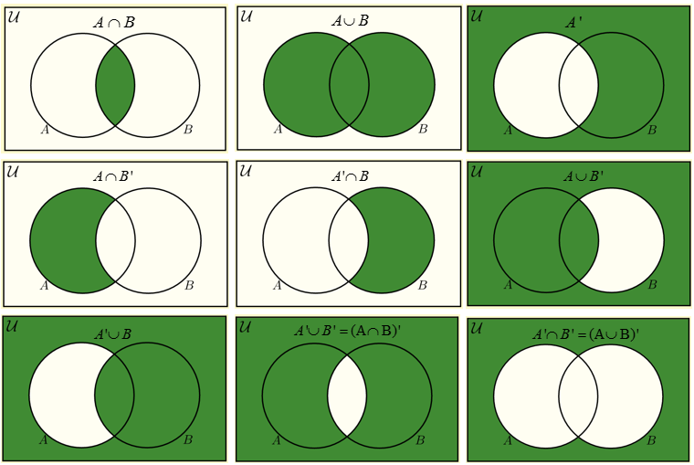

# اعمال روی مجموعه ها

## اجتماع دو مجموعه

فرض کنید $B,A$ دو مجموعه باشند اجتماع دو
مجموعه $B,A\ $ را با نماد $B \cup A$ نشان می
دهند و آن مجموعه تمام اشیایی است که به $A$ یا
به $B$ یا به هر دو تعلق دارد. تعریف
اجتماع دو مجموعه به زبان ریاضی به صورت زیر
است.

$$A \cup B = \{ x:x \in A\ \ \ \ \ \ \ \ \ \ \ \  \vee \ \ \ \ \ \ \ \ \ \ \ \ \ \ \ x \in B\}$$

نمایش اجتماع دو مجموعه بوسیله نمودار ون :

## مثال

اگر $A = \{ 1,2,5\}$ و $B = \{ 2,3,4,5\}$
آنگاه :$A \cup B = \{ 1,2,3,4,5\}$
>
اگر $A = \{ x|x \in N,x \leq 6\}$ و
$B = \{ 3,6,9,12,15\}$ باشد ،مجموعه $A \cup B$ را
بیابید.
>
حل:
ابتدا عضو های مجموعه $A$ را مشخص می کنیم.

$$A = \left\{ x \middle| x \in N,x \leq 6 \right\} = \left\{ 1,2,3,4,5,6 \right\}\\
B = \left\{ 3,6,9,12,15 \right\}\\ A \cup B = \{ 1,2,3,4,5,6,9,12,15\}$$

## ویژگی های اجتماع مجموعه ها

اجتماع دو مجموعه دارای ویژگی هایی است که در زیر آنها را بیان می
کنیم.

1-اجتماع هر مجموعه با خودش برابر خود آن مجموعه است.
$A \cup $A$ = A$

2- اجتماع هر مجموعه با مجموعه تهی برابر خود آن مجموعه است.
$A \cup \varnothing = A$

3- اجتماع هر مجموعه با متمم آن برابر مجموعه مرجع است.
$A \cup A^{'} = M$

4-اجتماع دو مجموعه دارای خاصیت جابجایی است.
$A \cup B = B \cup A$

5- $A \subset (A \cup B)\ \ ,\ \ B \subset (A \cup B)$

6- $A \subset B \Rightarrow A \cup B = B$

7- $\left\{ \begin{matrix}
A \subset C \\
B \subset C \\
\end{matrix} \right.\  \Rightarrow (A \cup B) \subset C$

8- برای هر سه مجموعه دلخواه $C,B,A$ داریم :

$$A \cup (B \cup C) = (A \cup B) \cup C$$

به ویژگی شماره 8 خاصیت شرکت پذیری اجتماع گویند.

9- اجتماع هر مجموعه با مجموعه مرجع برابر مجموعه مرجع است.

$$A \cup M = M$$

## برهان

اثبات ویژگی 8:

کافی است ثابت کنیم اگر
$x \in \lbrack $A$ \cup (B \cup C)\rbrack$ آنگاه
$x \in \lbrack(A \cup B) \cup C\rbrack$ و برعکس.

اثبات 1)

$$x \in \left\lbrack A \cup (B \cup C) \right\rbrack \Rightarrow \left\lbrack x \in A \vee x \in (B \cup C) \right\rbrack$$

$$\Rightarrow \left\lbrack x \in A \vee (x \in B \vee x \in C) \right\rbrack$$

$$\Rightarrow \left\lbrack (x \in A \vee x \in B) \vee x \in C \right\rbrack$$

$$\Rightarrow \left\lbrack \left( x \in (A \cup B \right) \vee x \in C \right\rbrack$$

$$\Rightarrow x \in \lbrack(A \cup B) \cup C\rbrack$$

$$\Rightarrow \left\lbrack A \cup (B \cup C)\rbrack \subset \lbrack(A \cup B) \cup C \right\rbrack$$

اثبات 2)

$$x \in \left\lbrack (A \cup B) \cup C \right\rbrack \Rightarrow \left\lbrack x \in (A \cup B) \vee x \in C \right\rbrack$$

$$\Rightarrow \left\lbrack (xA \cup x \in B) \cup x \in C \right\rbrack$$

$$\Rightarrow \left\lbrack x \in A \vee (x \in B \vee x \in C \right\rbrack$$

$$\Rightarrow \left\lbrack x \in A \vee x \in (B \cup C) \right\rbrack$$

$$\Rightarrow x \in \left\lbrack A \cup (B \cup C) \right\rbrack$$

$$\Rightarrow \left\lbrack (A \cup B) \cup C\rbrack \subset \lbrack A \cup (B \cup C) \right\rbrack$$

از روابط 1 و 2
$\Rightarrow (A \cup B) \cup C = A \cup (B \cup C)$

## اشتراک دو مجموعه

تعریف:اشتراک دو مجموعه $A$ و $B$ را با
نماد $A \cap B$ نشان می دهند و آن مجموعه تمام اشیایی است که
هم به $A$ و هم به $B$ تعلق دارند. تعریف
اشتراک *دو* مجموعه به زبان ریاضی به صورت زیر
است.

$$A \cap B = \{ x| \in A \land x \in B\}$$

نمایش اشتراک دو مجموعه بوسیله دو نمودار ون :

$$A \cap B$$

## مثال

اشتراک دو مجموعه $A = \left\{ 1,2,5 \right\}$
و $B = \{ 2,3,4,5\}$ رابیابید.

$$A \cap B = \left\{ 1,2,5 \right\} \cap \left\{ 2,3,4,5 \right\} = \{ 2,5\}$$

اگر $A = \{ x|x = \frac{K + 1}{2},k \in N$ ،
$B = \{ x|x\frac{k + 3}{2},k \in N,k \leq 5\}$ مجموعه
$A \cap B$ را بیابید.

حل:ابتدا عضو های مجمو عه های $A$ و $B$ را
بدست آوریم.

$$A = \left\{ 1,\frac{3}{2},2,\frac{5}{2},3 \right\}$$

$$B = \left\{ 2,\frac{5}{2},3,\frac{7}{2},4 \right\}$$

$$A \cap B = \{ 2,\frac{5}{2},3\}$$

## ویژگی های اشترک مجموعه ها

اشتراک دو مجموعه مانند اجتماع دو مجموعه دارای ویژگی هایی است که در زیر
ویژگی های اشتراک را بیان می کنیم.

1-اشتراک هر مجموعه با خودش برابر خود آن مجموعه است.
$A \cap A = A$

2- اشتراک هر مجموعه با مجموعه تهی برابر تهی است.
$A \cap \varnothing = \varnothing$

3- اشتراک هر مجموعه با مجموعه مرجع برابر خود آن مجموعه است.
$A \cap M = A$

4- اشتراک هر مجموعه با متمم آن برابر تهی است.
$A \cap A^{'} = \varnothing$

5-برای هر دو مجموعه دلخواه $A$ و$B$
داریم $(A \cap B) \subset A\ ,\ \ (A \cap B) \subset B$

6-اشتراک دو مجموعه خاصیت جابجایی
دارد.$(A \cap B) = (B \cap A)\ $

7-
$$\left\{
    \begin{matrix} C \subset A \\
    C \subset B \\
    \end{matrix} \right.\  
    \Rightarrow
    C \subset (A \cap B)
$$

8-
$A \subset B \Rightarrow A \cap B = A$

9- $A \cap (B \cap C) = (A \cap B) \cap C$ (خاصیت شرکت
پذیری اشتراک )

برای اثبات ویژگی شماره 9 اشتراک مانند اثبات ویژگی 8 اجتماع مجموعه ها
عمل می کنیم. به عنوان تمرین برعهده خواننده واگذار می شود.

## مثال

با استفاده از تصاویر ون نشان دهید:

$$A∩ (B U C ) = ( A ∩ B ) U ( A∩ C )$$

دقت کنید که این دایره ها چنان رسم می شوند که کلی ترین حالت ممکن برای
مسا له ی مورد نظر تحت پوشش قرار گیرد. باید دایره ها (مجموعه ها) همگی به
طور کامل داخل مجموعه مرجع قرار داشته باشند و همچنین باید همه ی دایره ها
دو به دو با هم اشتراک داشته باشند .

 شکل1. (الف) (C∩ A) U
( B∩ A) کل قسمتی است که هاشور خورده هاست. (ب)
(cU B) ∩ $A$ قسمتی است که از هر طرف
هاشور خورده است .

## دو مجموعه جدا از هم

دومجموعه $A$ و $B$ را جدا از هم گویند هر
گاه $A \cap B = \varnothing$ باشد. در شکل زیر دو مجموعه جدا
از هم را مشاهده می کنیم.

## تفاضل دو مجموعه

تفاضل دو مجموعه $A$ وb را با نماد
A-B نشان می دهند و آن مجموعه تمام اشیایی است که به $A$ تعلق
دارد ، ولی به B تعلق ندارد. یعنی
$A - B = \{ x|x \in $A$ \land x \notin B\}$

نمایش تفاضل $A$ و B بوسیله نمودار
ون:

$A - B$

## مثال

* اگر
$B = \left\{ 2,4,6 \right\}\ \ \ \ ,\ \ A = \{ 1,2,3,4,5\}$
آنگاه $A - B$ و $B - A$ را
بیابید.

حل:
$A - B = \left\{ 1,2,5 \right\}\ \ \ \ \ \ \ \ \ \ \ \ \ \ \ \ \ \ \ \ B - A = \{ 6\}$

* اگر
$B = \left\{ b,c,d,e,f \right\}\ \ \ \ ,\ \ A = \{ a,b,c,d\}$ مجموعه
های $A - (A \cap B),\ A - B $ را پیدا کنید.

حل:
$A - B = \left\{ a,b,c,d \right\} - \left\{ b,c,d,e,f \right\} = \{ a\}$

$$A - (A \cap B) = \left\{ a,b,c,d \right\} - \left\{ b,c,d \right\} = \{ a\}$$

* نشان دهید که $A - B = A \cap B'$

حل :

$$x \in A \cap B^{'} \Longleftrightarrow (x \in A) \land (x \in B^{'})$$

$$\Leftrightarrow (x \in A) \land (x \in (M - B))$$

$$\Leftrightarrow (x \in A) \land (x \in M \land x \notin B)$$

$$\Leftrightarrow \lbrack(x \in A) \land (x \in M \land )\rbrack \land x \notin B)$$

$$\Leftrightarrow x \in (A \cap M) \land x \notin B)$$

$$\Leftrightarrow x \in A \land x \notin B)$$

$$\Leftrightarrow x \in (A - B)$$

بنابراین $A - B = A \cap B'$

## گزاره

اگر $A$ و $B$ دو مجموعه باشند آنگاه
:

الف ) $\left( A^{'} \right)^{'} = A$

ب) $A \cup A^{'} = M\ ,\ A \cap A^{'} = \varnothing$

پ) $B' \subseteq A' \Leftrightarrow A \subseteq B$

ت)
$M^{'} = \varnothing\ \ \ \ \ \ \ \ \ \ ,\ \ \ \ \ \ \ \ \ \ \ \varnothing^{'} = M$

## برهان

اثبات الف:

اثبات
1:$x \in (A^{'})' \Rightarrow x \notin A' \Rightarrow x \in A$

اثبات
2:$x \in A \Rightarrow x \notin A^{'} \Rightarrow x \in (A^{'})'$

بنا براین از روابط (1) و (2) نتیجه می شود که
$\left( A^{'} \right)^{'} = A$

اثبات پ:فرض می کنیم $A \subseteq B$

$$\forall x \in B' \Rightarrow x \notin B \Rightarrow x \notin A \Rightarrow x \in A' \Rightarrow B' \subseteq A'$$

بالعکس:فرض می کنیم $B' \subseteq A'$

$$\forall x \in A \Rightarrow x \notin A' \Rightarrow x \notin B' \Rightarrow x \in B \Rightarrow A \subseteq B$$

پس ثابت کردیم که
$A \subseteq B \Leftrightarrow B' \subseteq A'$

اثبات قسمت های ب و ت به عنوان تمرین بر عهده خواننده واگذر می
شود.

## قوانین دمورگان

اگر $A$ و $B$ دو مجموعه دلخواه باشند ،
آنگاه

الف ) $(A \cup B)^{'} = A' \cap B'$

ب) $(A \cap B)^{'} = A' \cup B'$

## برهان

الف ) ثابت می کنیم که هر گاه $x \in (A \cup B)'$
آنگاه $x \in (A' \cap B')$ و برعکس

1)

$\forall x \in (A \cup B)^{'}$

$$\Rightarrow x \notin (A \cup B)$$

$$\Rightarrow (x \notin A) \land (x \notin B)$$

$$\Rightarrow (x \in A') \land (x \in B')$$

$$\Rightarrow x \in (A' \cap B')$$

$$\Rightarrow (A \cup B)' \subset (A'\bigcap B')$$

2)

$$\forall x \in {A' \cap B}^{'}$$

$$\Rightarrow (x \in A^{'}) \land (x \in B')$$

$$\Rightarrow (x \notin A) \land (x \notin B)$$

$$\Rightarrow x \notin (A \cup B)$$

$$\Rightarrow x \in (A \cup B)'$$

$$\Rightarrow (A' \cup B') \subset (A \cup B)'$$

$$(1),(2) \Rightarrow (A \cup B)^{'} = A' \cap B'$$

اثبات قسمت (ب) مشابه قسمت (الف) است به عنوان تمرین بر عهده خواننده
واگذار می شود.

## تفاضل متقارن دو مجموعه

تفاضل متقارن دو مجموعه $A$ و $B$ را با
نماد $A\mathrm{\Delta}B$ نمایش می دهند و آن مجموعه تمام
اشیایی است که به $A - B$ یا $B - A$ تعلق دارد.
یعنی $A\mathrm{\Delta}B = (A - B) \cup (B - A)$

نمایش $A\mathrm{\Delta}B$ بوسیله نمودار
ون: $M$

$$A\mathrm{\Delta}B$$

## مثال

اگر $A = \{ 2,3,5,7,9\}$ و $B = \{ 1,2,3,4\}$
آنگاه $A\mathrm{\Delta}B$ را بیابید.

$$A\mathrm{\Delta}B = (A - B) \cup (B - A) = \left\{ 5,7,9 \right\} \cup \left\{ 1,4 \right\} = \left\{ 1,4,5,7,9 \right\}$$

$$A\mathrm{\Delta}B = (A - B) \cup (B - A) = (A \cup B) - (A \cap B)$$

## خواص تفاضل متقارن دو مجموعه

1)تفاضل متقارن دو مجموعه خاصیت جابجایی دارد.

$$A\mathrm{\Delta}B = B\mathrm{\Delta}A$$

2)تفاضل متقارن خاصیت شرکت پذیری دارد.

$$A\mathrm{\Delta}(B\mathrm{\Delta}C) = (A\mathrm{\Delta}B)\mathrm{\Delta}C$$

3)تفاضل متقارن هر مجموعه با مجموعه تهی برابر خود آن مجموعه
است.

$$A\mathrm{\Delta}\varnothing = A$$

4)تفاضل متقارن هر مجموعه با متمم آن برابر مجموعه مرجع
است.

$$A\mathrm{\Delta}A^{'} = M$$

5)برای سه مجموعه A,B,C داریم :

$$A\mathrm{\Delta}B = A\mathrm{\Delta}C \Rightarrow B = C$$

6)برای دو مجموعه دلخواه A,B داریم :

$$A\mathrm{\Delta}B = \varnothing \Rightarrow A = B$$

7)تفاضل متقارن هر مجموعه با خودش برابر تهی است.

$$A\mathrm{\Delta}A = \varnothing$$

## برهان

اثبات 1 :

$$A\mathrm{\Delta}B = (A - B) \cup (B - A) = (B - A) \cup (A - B) = B\mathrm{\Delta}A$$

اثبات دیگر ویژگیهای تفاضل متقارن دو مجموعه به عنوان تمرین بر عهده
خواننده واگذار می شود.

## گزاره

همه قانون های جبر مجموعه ها را در زیر می آوریم
:

1-شرکت پذیری :

$$1)\ (A \cup B) \cup C = A \cup (B \cup C)$$

$$2)\ (A \cap B) \cap C = A \cap (B \cap C)$$

2-هم توانی :

$$3)A \cup A = A$$

$$4)A \cap A = A$$

3-جابجایی :

$$5)A \cup B = B \cup A$$

$$6)\ A \cap B = B \cap A$$

4-توزیع پذیری :

$$7)\ A \cup (B \cap C) = (A \cup B) \cap (A \cup C)$$

$$8)A \cap (B \cup C) = (A \cap B) \cup (A \cap C)$$

$$9)A \cap A' = \varnothing\ \ \ \ \ \ \ \ \ \ \ \ \ \ \ \ \ \ \ \ \ 10)A \cup A' = M$$

5- متمم:

$$11)\left\{ \begin{matrix}
M = \varnothing \\
\varnothing^{'} = M \\
\end{matrix} \right.\ \ \ \ \ \ \ \ \ \ \ \ \ \ 12)(A)' = A\ \ \ $$

6-دمورگان :

$$13)\ (A \cup B)^{'} = A^{'} \cap B^{'}\ \ \ \ \ \ \ \ \ \ \ \ \ \ \ \ \ \ \ \ \ \ \ \ \ \ \ \ \ \ \ \ \ \ \ \ \ \ \ \ \ \ \ \ \ \ \ \ \ \ \ \ \ \ \ \ \ \ \ \ \ \ \ \ \ \ \ \ \ \ \ 14)(A \cap B)^{'} = A^{'} \cup B^{'}$$

7-جذب :

$$15)A \cap (A \cup B) = A\ \ \ \ \ \ \ \ \ \ \ \ \ \ \ \ \ \ \ \ \ \ \ \ \ \ \ \ \ \ \ \ \ \ \ \ \ \ \ \ \ \ \ \ \ \ \ \ \ \ \ \ \ \ \ \ \ \ \ \ \ \ \ \ \ \ \ \ \ \ \ \ \ \ \ \ \ 16)A \cup (A \cap B) = A$$

8- اتحاد های دیگر :

$$17)A \cap \varnothing = \varnothing\ \ \ \ \ \ \ \ \ \ \ \ \ \ \ \ 18)A \cup \varnothing = A\ \ \ \ \ \ \ \ \ \ 19)A \cap M = A\ \ \ \ \ \ \ \ \ \ \ \ \ \ \ \ \ \ 20)A \cup M = M$$

## مثال:

درستی تساوی زیر را ثابت کنید.
$(A - B) \cup (A \cap B) = A$
>
حل:
$= (A \cap B') \cup (A \cap B) = A \cap \left( B^{'} \cup B \right) = A \cap M = A$
از طرف چپ
>
درستی تساوی های زیر را ثابت کنید.

$$1)\ (A \cup B) - C = (A - C) \cup (B - C)$$

$$2)\ A - (B \cap C) = (A - B) \cup (A - C)$$

$$3)\ A - B = A - (A \cap B)$$

$$4)\ (A - B) \cap B = \varnothing)$$

$$5)\ (A - B) \cup A = A$$

حل :

1: طرف چپ :

$$= (A \cup B) \cap C'$$

$$= (A \cap C') \cup (B \cap C')$$

$$= (A - C) \cup (B - C)$$

2:طرف چپ :

$$= A \cap (B \cap C)'$$

$$= A \cap (B^{'} \cup C^{'})$$

$$= \left( A \cap B^{'} \right) \cup (A \cap C^{'})$$

$$= (A - B) \cup (A - C)$$

3)طرف راست :

$$= A \cap (A \cap B^{'})$$

$$= A \cap (A^{'} \cup B^{'})$$

$$= \left( A \cap A^{'} \right) \cup (A \cap B^{'})$$

$$= \varnothing \cup (A \cap B^{'})$$

$$= A \cap B'$$

$$= A - B$$

4)طرف چپ :

$$= (A \cap B^{'}) \cap B$$

$$= A \cap \left( B^{'} \cap B \right) = A \cap \varnothing = \varnothing$$

5)طرف چپ :

$$= \left( A \cap B^{'} \right) \cup A = \left( A \cap B^{'} \right) \cup (A \cap M)$$

$$= A \cap \left( B^{'} \cup M \right) = A \cap M = A$$

